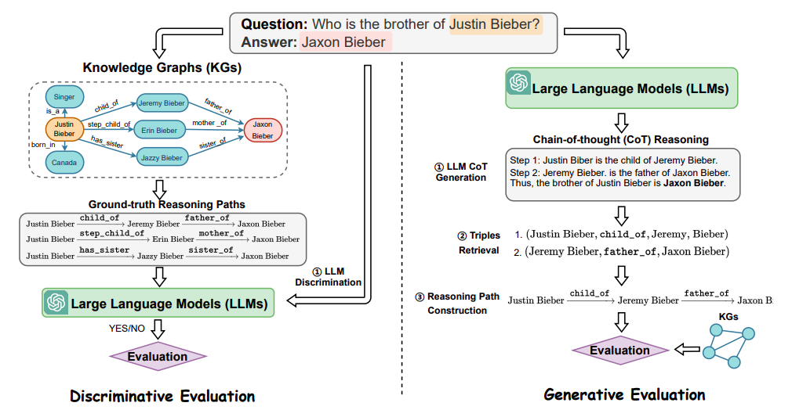
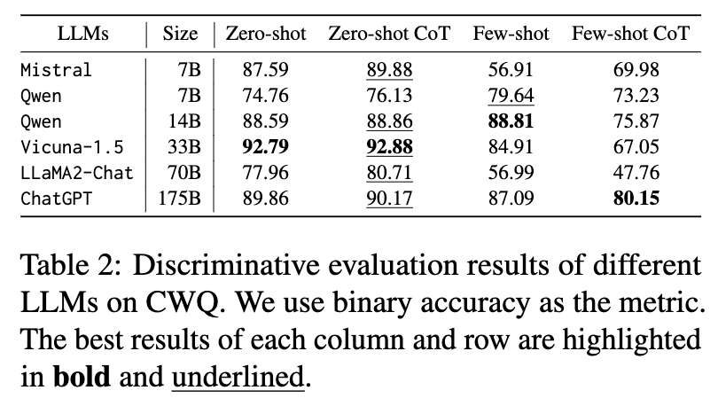
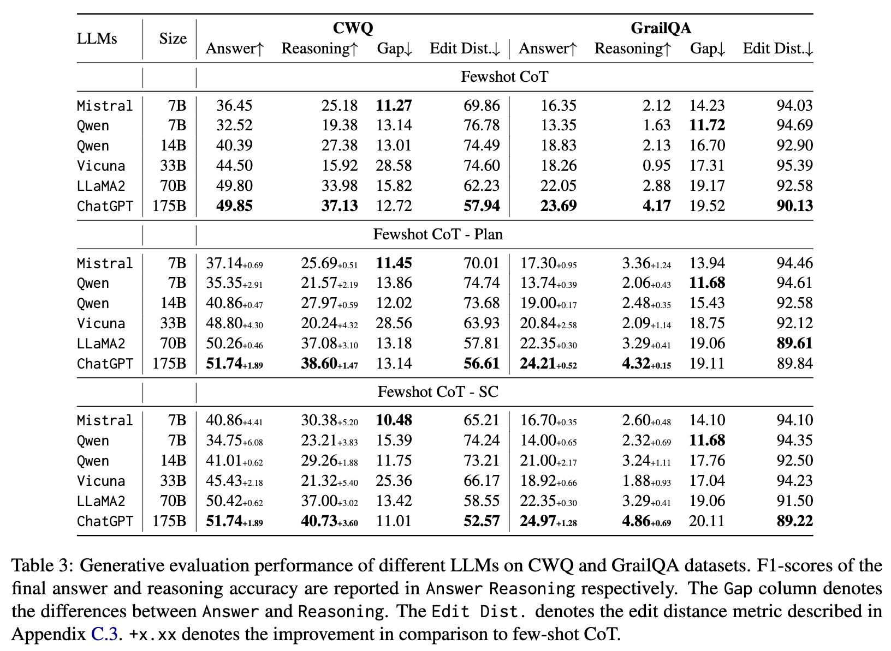

Direct Evaluation of CoT in Multi-hop Reasoning with Knowledge Graphs
---
Official Implementation of ["Direct Evaluation of Chain-of-Thought in Multi-hop Reasoning with Knowledge Graphs"](https://arxiv.org/abs/2402.11199).

Has been accepted at [ACL2024](https://2024.aclweb.org/) Findings.



Aiming evaluate not only final answers but also intermediate steps in the CoT reasoning capabilities of LLMs in multi-hop question answering, the paper proposed 2 evaluation modules: 
1. **Discriminative**: assess LLMs' knowledge of reasoning
2. **Generative**: assess the accuracy of the generated CoT by utilizing knowledge graphs (KGs).

In addition, we do ablation studies to evaluate the fine-grain CoT generation to calculate edit-distance & reasoning errors.

## Requirements
```sh
conda create --name llm-reasoning-cert python=3.8
conda activate llm-reasoning-cert
```
```sh
pip install -r requirements.txt
```

## Datasets
The paper uses 2 datasets: [CWQ](https://allenai.org/data/complexwebquestions) and [GrailQA](https://huggingface.co/datasets/grail_qa) as initiate datasets for experiments.

Then, extract subgraph and ground-truth reasoning path based on SPARQL.

Final datasets used for the paper are uploaded into HuggingFace: (Note: update later)
1. [CWQ-Subgraph-Eval]()
2. [GrailQA-Subgraph-Eval]()

### Preprocess for each dataset: 
Aim: create subgraphs for querying ground-truth reasoning path & creating VectorDB
#### Create subgraphs
Code at `./preprocess_data`
1. Create **subgraph** from the **raw-subgraph** via the detail implementation in [preprocess's readme](./preprocess_data/readme.md) 
3. Get **groundtruth reasoning path** via the **subgraph**, `answer entities` and `topic entities`
```bash
python ./preprocess_data/ground_truth_paths.py
```
4. Rearrange questions according to the number of edge of **groundtruth reasoning path**
```bash
python ./preprocess_data/splitted_ground_truth_paths.py
```
We only use questions >=2 hops in the corresponding reasoning path.

#### Create VectorDB
`FAISS` & `sentence-transformers/all-mpnet-base-v2` are used to create VectorDB before retrieving 
```bash
DATASET='cwq' # 'grail_qa
sbatch scripts/gen-cert/extract_triplet.sh $DATASET
```
you can setup addition arguments: 
- embed_model_name. Default is `sentence-transformers/all-mpnet-base-v2`
- top_k. Default is `10`
- device. Default is `cpu`

!Note: remember re-setup them in `./generative-cert.py#L228`


### Data for Discriminative
Download data at [here](https://drive.google.com/file/d/1jhZ0qwg2pfuxSiBqtzoGQNjRkoHfdC99/view?usp=sharing)

#### Generate negative reasoning paths
- Negative generation model:
  1. `replace`: replace the entities in reasoning paths.
  2. `reorder`: reorder the reasoning paths.
  3. `mislead`: generate the reasoning paths leading to incorrect answers. 
- Code:
  
```python
# 1. Generate supgraph for misguide paths
python preprocess_data/subgraph_discriminative_cert.py
# 2. Generate negative paths:
## - CWQ dataset
python gen_negative.py --data_path data/cwq_test_res.csv --kg_path data/cwq_test.jsonl_cwq_test.jsonl --mode {'mislead', 'reorder', 'replace'}
## - GrailQA dataset
python gen_negative.py --data_path data/multi_hop_grailqa.csv --kg_path data/grail_w_kg.jsonl --mode {'mislead', 'reorder', 'replace'}
```


## Framework
Set your OpenAI api key & Huggingface key (if needed) in `.env` (check file `.env.example` as the example).

### Discriminative Mode
- Evaluation for ground-truth reasoning paths
```bash
    sh scripts/disc-cert/submit_discriminative_cert.sh
```
- Evaluation for generated negative reasoning paths
```bash
    sh scripts/disc-cert/submit_discriminative_cert_neg.sh
```
- Get results
```python
python scripts/disc-cert/summary_results.py
```

### Generative Mode
#### Stage1: LLM prompting for structured answer
1. ChatGPT
```bash
sh scripts/gen-cert/llm_prompting.sh
```
2. HF models: Llama2 7B/13B/70B chat-hf, Mistral-7B-Instruct-v0.1, Qwen-14B-Chat, Vicuna-33b-v1.3
```bash
sh generative_cert/scripts/fitcluster/script.sh
```

#### Stage 2 & 3: Retrieval & Evaluation
1. Main result
```bash
sh scripts/gen-cert/job_eval_llm.sh
```
2. The fine-grained generative evaluation: edit-distance score
```bash
sh scripts/gen-cert/job_eval_llm_finegrained.sh
python finegrained_analysis.py
```
3. Run the analysis for reasoning errors
```bash
python finegrained_analysis.py
```

## Results



---
## Citation
If you find this paper or the repo useful for your work, please consider citing the paper
```
@misc{nguyen2024direct,
    title={Direct Evaluation of Chain-of-Thought in Multi-hop Reasoning with Knowledge Graphs},
    author={Minh-Vuong Nguyen and Linhao Luo and Fatemeh Shiri and Dinh Phung and Yuan-Fang Li and Thuy-Trang Vu and Gholamreza Haffari},
    year={2024},
    eprint={2402.11199},
    archivePrefix={arXiv},
    primaryClass={cs.CL}
}
```
